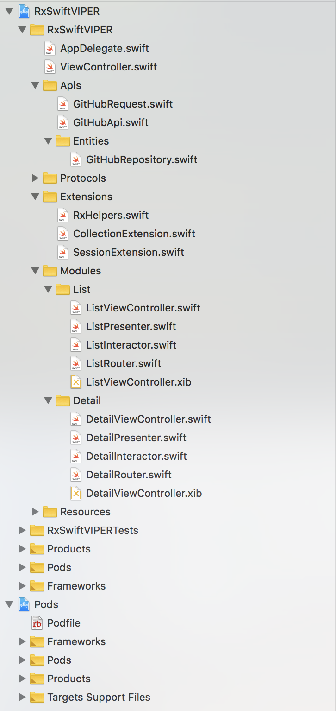
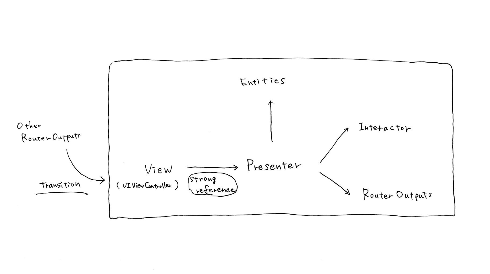

# RxSwiftVIPER (View, Interactor, Presenter, Entity, Router) with RxSwift

RxSwiftVIPER is an sample iOS App written in RxSwift using the [VIPER](https://cheesecakelabs.com/blog/ios-project-architecture-using-viper/) architecture.  
Also RxSwiftVIPER is not a strict [VIPER](https://cheesecakelabs.com/blog/ios-project-architecture-using-viper/) architecture.   
Part of the project is a unique way.

[](https://swift.org)

## Sample App



### Architecture


### Run Sample 
1. Clone this repository.
    ```
    git clone git@github.com:yokurin/RxSwift-VIPER-iOS.git
    ```

2. Open `RxSwiftVIPER.xcworkspace` in Xcode. 

3. Run

## Description
  
RxSwiftVIPER is not a strict [VIPER](https://cheesecakelabs.com/blog/ios-project-architecture-using-viper/) architecture.   
Part of the project is a unique way. This is just a suggestion.  

With [RxSwift](https://github.com/ReactiveX/RxSwift) , [RxSwiftCommunity/Action](https://github.com/RxSwiftCommunity/Action),  [APIKit](https://github.com/ishkawa/APIKit)

See Source code [here](https://github.com/yokurin/RxSwift-VIPER-iOS/tree/master/RxSwiftVIPER/Modules)

### Unit Test 

WIP ... 

### Xcode Template ( xctemplate )

WIP ...

## Requirements

- Xcode 10.0+
- Swift 4.2+

## Installation

```
git clone git@github.com:yokurin/RxSwift-VIPER-iOS.git
```

## See Also
### [yokurin/Swift-VIPER-iOS](https://github.com/yokurin/Swift-VIPER-iOS)
Adopted Delegate Pattern. Not use RxSwift


### [yokurin/Swift-MVCR-iOS](https://github.com/yokurin/Swift-MVCR-iOS)
SwiftMVCR is an sample iOS App written in Swift using the MVCR architecture. (Model, View, Controller, Router)
Adopted Delegate Pattern. Not use RxSwift


## Author

Tsubasa Hayashi, yoku.rin.99@gmail.com

## License

RxSwiftVIPER is available under the MIT license. See the LICENSE file for more info.
